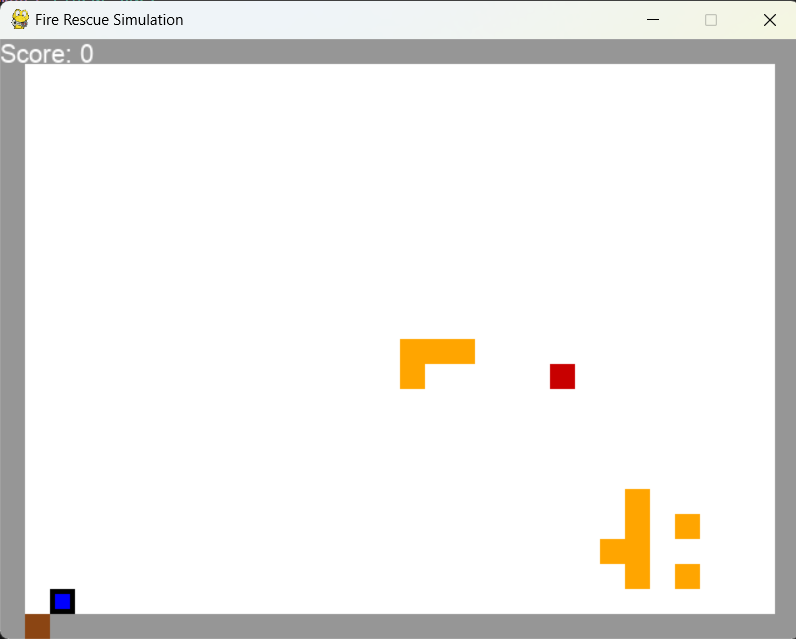
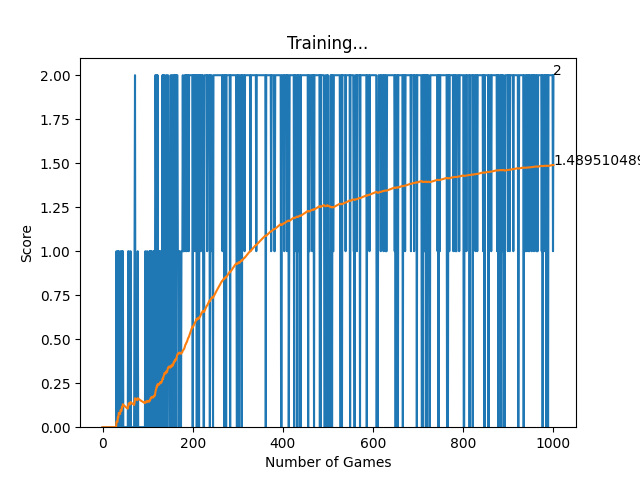

# Fire Rescue Simulation with Deep Q-Learning

This project implements a 2D Fire Rescue Simulation using Python and Pygame, where an AI agent learns to navigate through a burning room to rescue a victim using reinforcement learning techniques (Deep Q-Networks). 

## Overview

The agent spawns at the bottom right of the room and has to reach the victim and carry the victim outside of the burning room through the same door the agent entered through.

<div align="center">
    
</div>

## Results

The pretrained model was trained on 1000 simulations. A score of 1 indicates that the agent reached the victim successfully and a score of 2 means that the agent carried the victim outside of the burning room succesfully
The agent learns to navigate the environment efficiently, rescuing the victim and avoiding the fire. The agent successfully rescues the victim 90% of the simulations. The training progress can be visualized using the plotting functions in `helper.py`.

<div align="center">
    
</div>

## Project Structure

- **runmodel.py**: Main script to run the pretrained model in the  simulation.
- **game.py**: Contains the implementation of the game environment including reward functions, logic for movement, fire spread, and collision detection.
- **helper.py**: Used for plotting the scores during training.
- **model.py**: Defines the neural network model and training logic.

Install the required packages using:
```bash
pip install -r requirements.txt
```

## How to Run

1. Clone the repository:
   ```bash
   git clone <https://github.com/KarimElgazaar/FireRescueSim>
   ```
2. Navigate to the project directory:
   ```bash
   cd <Fire_Rescue_Sim>
   ```
3. Run the trained model in the simulation:
   ```bash
   python runmodel.py
   ```

## How It Works

- The agent is represented by a neural network (`Linear_QNet`) which takes the current state of the game as input and outputs the optimal action.
- The game environment is implemented in `game.py` and features walls, fires, and a victim to rescue.
- The agent's goal is to rescue the victim while avoiding collisions with walls and fires.
- The `QTrainer` class in `model.py` is used for training the agent using the Deep Q-Learning algorithm.
- The reward values for each of the outcomes was achieved by trail and error of many different reward values and the best performing was implemented. The agent is rewarded positvely for correct outcomes and negatively for incorrect outcomes.

## Contact

for any inquiries contact me at KarimElgazar74@gmail.com

